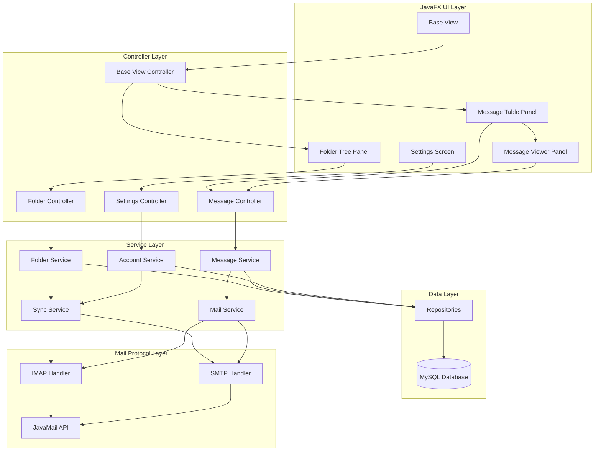
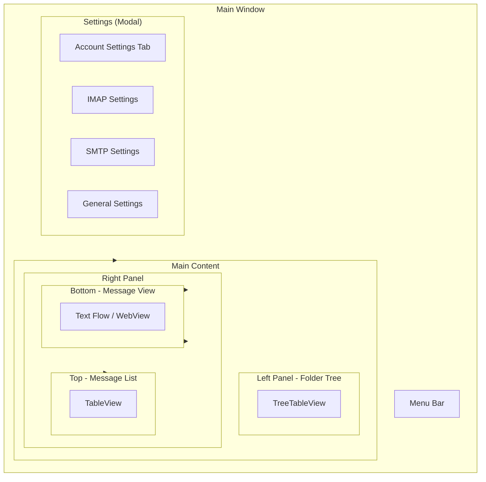

im# Terramail Email Application - Architecture Plan

## Overview

A desktop email client built with Java 21 and JavaFX, using MySQL for local storage, and supporting IMAP/SMTP protocols for email synchronization.

## Technology Stack

| Component | Technology |
|-----------|------------|
| Language | Java 21 |
| Build System | Gradle (Kotlin DSL) |
| UI Framework | JavaFX 21+ |
| Database | MySQL 8.x |
| Email Protocols | JavaMail API (IMAP/SMTP) |
| ORM | JDBC (raw SQL) or Hibernate (TBD) |
| Logging | SLF4J + Logback |

## Application Architecture



## Database Schema

```mermaid
erDiagram
    ACCOUNT {
        BIGINT id PK
        STRING name
        STRING email
        STRING imap_host
        INT imap_port
        STRING imap_user
        STRING imap_password
        STRING smtp_host
        INT smtp_port
        STRING smtp_user
        STRING smtp_password
        BOOLEAN imap_enabled
        BOOLEAN smtp_enabled
        STRING display_name
        STRING organization
        TIMESTAMP created_at
        TIMESTAMP updated_at
    }

    FOLDER {
        BIGINT id PK
        BIGINT account_id FK
        STRING name
        STRING path
        STRING unique_id_prefix
        INT message_count
        BOOLEAN is_subscribed
        BOOLEAN is_synched
        TIMESTAMP last_synched
        TIMESTAMP created_at
    }

    MESSAGE {
        BIGINT id PK
        BIGINT folder_id FK
        STRING message_id
        STRING in_reply_to
        STRING subject
        TEXT body_plain
        TEXT body_html
        TIMESTAMP received_date
        TIMESTAMP sent_date
        BOOLEAN is_read
        BOOLEAN is_flagged
        BOOLEAN is_deleted
        BOOLEAN has_attachments
        INT attachment_count
        BIGINT size_bytes
        TIMESTAMP local_received_at
    }

    RECIPIENT {
        BIGINT id PK
        BIGINT message_id FK
        STRING email
        STRING name
        STRING type !
    }

    ATTACHMENT {
        BIGINT id PK
        BIGINT message_id FK
        STRING filename
        STRING content_type
        BIGINT size_bytes
        STRING storage_path
        STRING charset
    }

    ACCOUNT ||--o{ FOLDER : has
    FOLDER ||--o{ MESSAGE : contains
    MESSAGE ||--o{ RECIPIENT : has
    MESSAGE ||--o{ ATTACHMENT : has
```

## Project Structure

```
terramail/
├── build.gradle.kts
├── settings.gradle.kts
├── gradle/
│   └── wrapper/
├── src/
│   ├── main/
│   │   ├── java/
│   │   │   └── com/terramail/
│   │   │       ├── TerramailApp.java          # JavaFX Application entry point
│   │   │       ├── controller/
│   │   │       │   ├── SettingsController.java
│   │   │       │   ├── BaseViewController.java
│   │   │       │   ├── FolderTreeController.java
│   │   │       │   ├── MessageTableController.java
│   │   │       │   └── MessageViewerController.java
│   │   │       ├── view/
│   │   │       │   ├── SettingsView.java
│   │   │       │   ├── BaseView.java
│   │   │       │   ├── FolderTreePanel.java
│   │   │       │   ├── MessageTablePanel.java
│   │   │       │   └── MessageViewerPanel.java
│   │   │       ├── service/
│   │   │       │   ├── AccountService.java
│   │   │       │   ├── FolderService.java
│   │   │       │   ├── MessageService.java
│   │   │       │   ├── SyncService.java
│   │   │       │   └── MailService.java
│   │   │       ├── repository/
│   │   │       │   ├── AccountRepository.java
│   │   │       │   ├── FolderRepository.java
│   │   │       │   ├── MessageRepository.java
│   │   │       │   ├── RecipientRepository.java
│   │   │       │   └── AttachmentRepository.java
│   │   │       ├── model/
│   │   │       │   ├── Account.java
│   │   │       │   ├── EmailFolder.java
│   │   │       │   ├── EmailMessage.java
│   │   │       │   ├── Recipient.java
│   │   │       │   └── Attachment.java
│   │   │       ├── mail/
│   │   │       │   ├── ImapHandler.java
│   │   │       │   ├── SmtpHandler.java
│   │   │       │   └── MailSessionManager.java
│   │   │       ├── util/
│   │   │       │   ├── DatabaseUtil.java
│   │   │       │   ├── MailUtil.java
│   │   │       │   └── DateTimeUtil.java
│   │   │       └── config/
│   │   │           ├── AppConfig.java
│   │   │           └── DatabaseConfig.java
│   │   └── resources/
│   │       ├── fxml/
│   │       │   ├── settings.fxml
│   │       │   ├── base_view.fxml
│   │       │   ├── folder_tree_panel.fxml
│   │       │   ├── message_table_panel.fxml
│   │       │   └── message_viewer_panel.fxml
│   │       ├── styles/
│   │       │   └── main.css
│   │       └── application.properties
│   └── test/
│       └── java/
│           └── com/terramail/
├── sql/
│   └── schema.sql
└── gradlew
```

## UI Layout



## Base View Layout (FXML Structure)

```
SplitPane (horizontal)
├── Left Pane (fixed width ~250px)
│   └── FolderTreePanel
│       └── TreeTableView<AccountFolder>
└── Right Pane (resizable)
    └── SplitPane (vertical)
        ├── Top Pane (~40%)
        │   └── MessageTablePanel
        │       └── TableView<EmailMessage>
        │           ├── Column: Subject
        │           ├── Column: From
        │           ├── Column: Date
        │           └── Column: Flags
        └── Bottom Pane (~60%)
            └── MessageViewerPanel
                └── WebView / TextFlow
```

## Gradle Dependencies

```kotlin
dependencies {
    implementation(" javafx:javafx-controls:21.0.1")
    implementation(" javafx:javafx-fxml:21.0.1")
    implementation(" mysql:mysql-connector-java:8.3.0")
    implementation(" com.sun.mail:javax.mail:1.6.2")
    implementation(" org.slf4j:slf4j-api:2.0.11")
    implementation(" ch.qos.logback:logback-classic:1.4.14")
    implementation(" com.fasterxml.jackson.core:jackson-databind:2.16.1")
    testImplementation(" org.junit.jupiter:junit-jupiter:5.10.1")
}
```

## Development Phases

### Phase 1: Project Setup
- Initialize Gradle project with Kotlin DSL
- Configure JavaFX and dependencies
- Set up project structure
- Configure MySQL database schema

### Phase 2: Data Layer
- Create entity/model classes
- Implement repository layer
- Set up database connection pooling
- Create SQL schema migration scripts

### Phase 3: Mail Protocol Layer
- Implement IMAP handler for receiving/syncing emails
- Implement SMTP handler for sending emails
- Create mail session manager
- Implement folder synchronization

### Phase 4: Service Layer
- Implement account management service
- Implement folder service
- Implement message service
- Implement sync service

### Phase 5: UI - Core Views
- Create JavaFX application shell
- Implement base view layout
- Implement folder tree panel
- Implement message table panel
- Implement message viewer panel

### Phase 6: UI - Settings
- Create settings screen
- Implement account configuration forms
- Implement IMAP/SMTP settings
- Implement general settings

### Phase 7: Integration
- Connect UI to services
- Implement real-time sync
- Implement send/receive operations
- Add error handling and notifications

### Phase 8: Testing & Polish
- Write unit tests
- Write integration tests
- UI testing and polish
- Performance optimization
